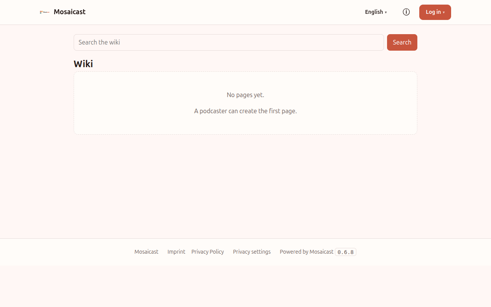

# mosaicast-plugin-wiki

> Site plugin: a simple wiki via the declarative schema provider (pages, revisions, search).

Part of **[Mosaicast](https://github.com/mosaicast)** — an extensible website platform for podcasts. Status: **v1 in development**.



## What is this?
A wiki for the site — lore, glossary, people, anything worth a page. It is the one plugin that declares a
relational **schema** instead of using the generic doc store, because a wiki is relational: full-text
search, revisions, backlinks and per-page sources are all queries a key/value store answers badly.

Pages live at **`/p/wiki/{slug}`**, so they are linkable and shareable; the plugin supplies OpenGraph
metadata and sitemap entries for them.

See `docs/ARCHITECTURE.md` for the big picture and `docs/BRIEF.md` for this repo's scope.

## Build & test
```bash
./build.sh                                       # -> dist/
cd backend && ./gradlew test                     # against the SDK test kit
cd frontend && npm test && npm run typecheck     # Vite does not type-check; tsc does
```

## Build & install
`./build.sh` -> `dist/` -> copy to `$MOSAICAST_PLUGINS_DIR` (or run `./install.sh`), restart core.
Core loads plugins **at startup only**, so every rebuild needs a restart.

```bash
./build.sh && MOSAICAST_PLUGINS_DIR=../mosaicast-core/plugins ./install.sh
```

From a release, an operator can skip all of that and install by spec — GitHub Releases are the index, so
there is no registry to register with:

```bash
MOSAICAST_PLUGINS="Mosaicast/mosaicast-plugin-wiki@v0.1.0#sha256:<digest from the release notes>"
```

Each release attaches `plugin.tgz` and publishes its SHA-256, so the spec above is pinned and auditable —
which matters, because a plugin runs in-process and unsandboxed.

## How it stores things
Three stores, each for what it is good at:

- **Schema** (`plugin_wiki_page`, `_revision`, `_link`, `_source`, `_media`) — the read model. The platform
  provisions the tables from `plugin.json`; the plugin never writes DDL. The frontend queries them
  read-only through `ctx.schema`.
- **Doc store** — the write channel. There are no schema writes over HTTP, so the editor saves a
  `draft:<slug>` document and the backend ingests it into the tables on its schedule. **A save is therefore
  eventually consistent**, and the UI says so rather than pretending otherwise.
- **Blobs** (`ctx.blobs`) — uploaded images and documents, served same-origin under `/api/`, so they need no
  CSP host and make no consent decision. A row stores the file's **ref**, never a URL. SVG is never stored.

## Contributing
Contributions welcome — see [`CONTRIBUTING.md`](CONTRIBUTING.md). In short: `git commit -s` (DCO, required), SPDX header in new files, add tests.

## License
**GNU Affero General Public License v3.0 or later** — see [`LICENSE`](LICENSE). Header per source file:
```
// SPDX-License-Identifier: AGPL-3.0-or-later
// SPDX-FileCopyrightText: 2026 The Mosaicast Authors
```

## Name & trademark
"Mosaicast" and the logo denote the official project. Please rename forks.
